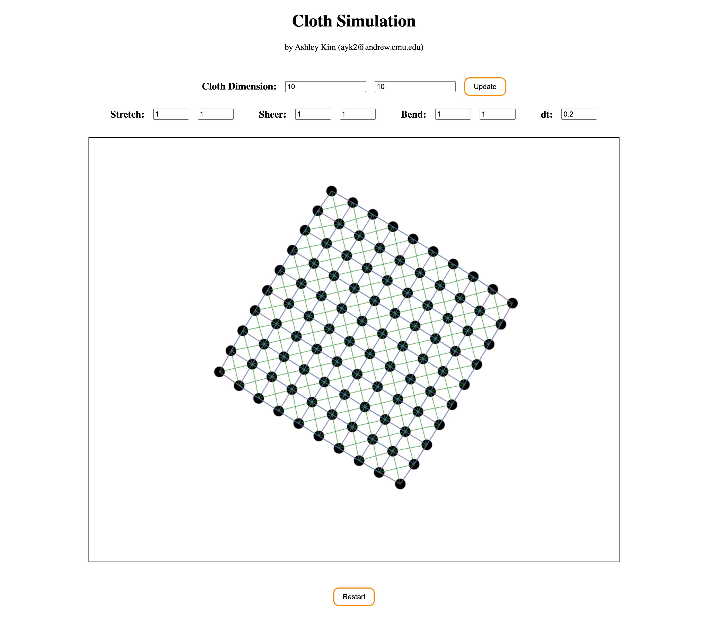

# Assignment 2. Simulation
Ashley Kim (ayk2@andrew.cmu.edu)  
3/20/2023

## Part 1 : Spring-Mass Cloth simulation ##

Based on the Spring-Mass Model, I created a cloth simulation with the three types of spring dampers: *stretch springs, sheer springs,* and *bend springs.*
I used javascript on html canvas to both draw and keep track of parameters for the particle points and spring edges. 
Each type of spring dampers are indicated using different colors:

* Stretch springs: red
* Sheer springs: green
* Bend springs: blue

### Interaction ###
Users can interact with this cloth simulation by **dragging** the particle points around the canvas using the cursor. 
The cloth will instantly follow and react to the movement defined by the user's mouse moves.

Cloth model can be updated or respawn from the starting position by clicking on each corresponding buttons (update and restart). Following parameters can be controlled for each cloth model:

* Number of particles in a row of the cloth
* Number of particles in a column of the cloth
* Spring constant (ks) of stretch springs
* Damping factor (kd) of stretch springs
* Spring constant (ks) of sheer springs
* Damping factor (kd) of sheer springs
* Spring constant (ks) of bend springs
* Damping factor (kd) of bend springs
* Timestep (dt) of the simulation
* Mass of individual particle
* Display boolean for drawing each particle as a black circle

Note that update button should be pressed to generate a new cloth model with indicated constant values.

### Example Cloth Simulations ###
1. Thin cloth (20 x 20)

**Stretch:** 0.2 0.2   |   **Sheer:** 0.2 0.2    |   **Bend:** 0.2 0.2    |   **dt:** 0.1    |   **mass:** 1

2. Thin cloth (10 x 10)

**Stretch:** 1.2 1.2    |   **Sheer:** 0.03 0.03    |   **Bend:** 1 1    |   **dt:** 0.1    |   **mass:** 7

3. Medium cloth (10 x 10)

**Stretch:** 1 1    |   **Sheer:** 0.3 0.3    |   **Bend:** 1 1    |   **dt:** 0.1    |   **mass:** 7

4. Heavy cloth (10 x 10)

**Stretch:** 1 1    |   **Sheer:** 1 1    |   **Bend:** 0.2 0.2    |   **dt:** 0.1    |   **mass:** 30

