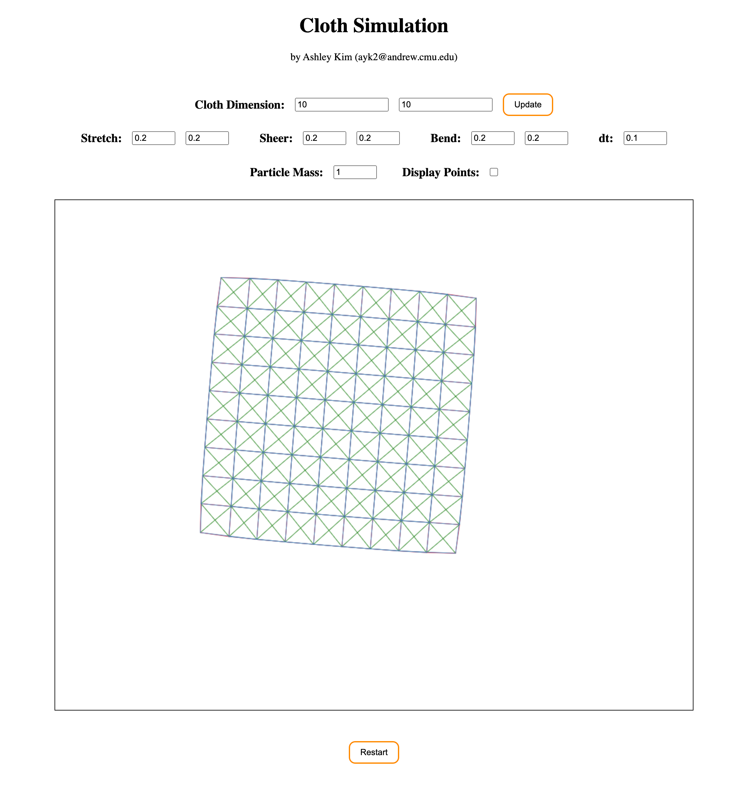

# Assignment 2. Simulation
Ashley Kim (ayk2@andrew.cmu.edu)  
3/20/2023

## Part 1 : Spring-Mass Cloth simulation ##

Based on the Spring-Mass Model, I created a cloth simulation with the three types of spring dampers: *stretch springs, sheer springs,* and *bend springs.*
I used javascript on html canvas to both draw and keep track of parameters for the particle points and spring edges. 
Each type of spring dampers are indicated using different colors:

* Stretch springs: red
* Sheer springs: green
* Bend springs: blue

### Interaction ###
Users can interact with this cloth simulation by **dragging** the particle points around the canvas using the cursor. 
The cloth will instantly follow and react to the movement defined by the user's mouse moves.
